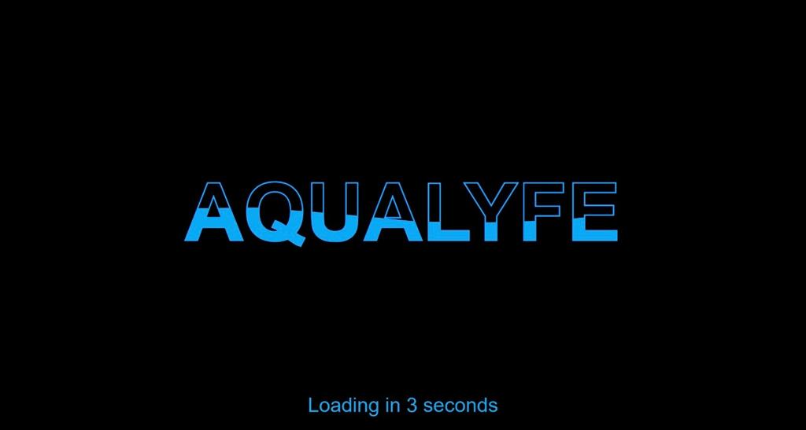
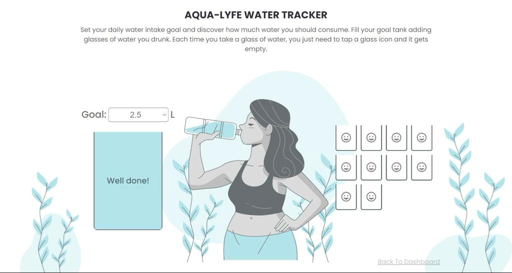
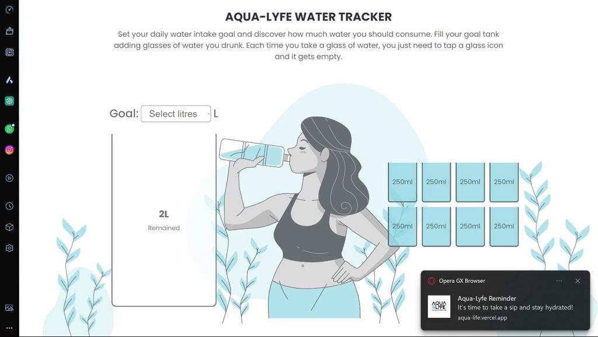
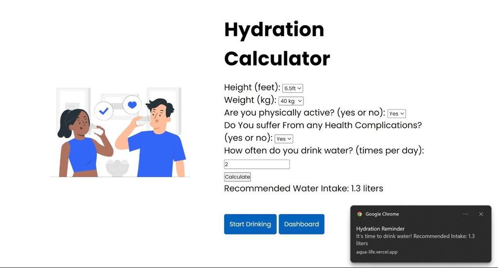

# AquaLyfe - Drink Water the Smart Way

Welcome to **AquaLyfe**, the ultimate web application to revolutionize your hydration game. 📱💧

...

## How the App works (Screenshots)

  <!-- Home Screen -->
  

    
    
Home Screen

  

  <!-- Water Tracker -->
  

    
    
Water Tracker

  

  <!-- Notification -->
  

    
    
Notification

  

  <!-- Weather Update -->
  

    
    
Weather Update

  

  <!-- Hydration Calculator -->
  

    
    
Hydration Calculator

  

...
## About AquaLyfe

AquaLyfe isn't just your ordinary water reminder app; it's your new hydration partner. We've added a splash of innovation to make your journey towards a healthier, more hydrated you more exciting.

## Features

- 📅 **Customizable Reminders**: AquaLyfe allows you to set personalized water intake reminders that align with your daily routine.
- 💧 **Water Tracking Made Easy**: Track your daily water intake effortlessly and stay on top of your hydration goals.
- 🎉 **Congratulatory Feature**: When you reach your daily water intake goal, AquaLyfe celebrates your success with a virtual high-five! 🙌
- 🌟 **New Feature - Find Nearby Supermarkets for Water**: Never run out of water again! AquaLyfe now helps you locate nearby supermarkets where you can conveniently purchase your preferred bottled water. Stay refreshed and hydrated, wherever you are.
- ☀️ **Weather Update**: Stay informed about the weather. AquaLyfe now provides you with weather updates, so you can plan your hydration according to the weather conditions. Whether it's a sunny day or a rainy afternoon, AquaLyfe helps you adjust your water intake accordingly.
- 🌿 **Healthy Drinks Recommendations**: Enhance your hydration experience with AquaLyfe's carefully curated selection of healthy drinks-🍵 🥤 🥛

## Why AquaLyfe?

AquaLyfe is more than just a hydration web app; it's your go-to solution for a well-hydrated lifestyle. Use AquaLyfe web app today and make every sip count.

Stay hydrated, stay healthy with AquaLyfe. 💦

## Pitch Deck

For more information about AquaLyfe, please check out our [Pitch Deck](https://www.canva.com/design/DAF1jF2Rx-E/uEvyCftKZpOn0QHq46MaJw/edit?utm_content=DAF1jF2Rx-E&utm_campaign=designshare&utm_medium=link2&utm_source=sharebutton)

## Kanban Board (Trello)

Explore our progress and development on our [Kanban Board](https://trello.com/b/oRogq09Y/aqualyf-hydration-reminder-app) in Trello.

## Coming Soon - AquaLyfe App

Exciting news! We're currently working on an AquaLyfe Mobile app to complement the mobile experience. Stay tuned for the release of the Mobile App version, which will bring AquaLyfe to your phone and other platforms.

**Stay hydrated, no matter where you are** - AquaLyfe is expanding to keep you refreshed.

## Contributors

- Magezi Joshua (Backend Developer)
- Himika Samuel (Project Manager)
- Mukiibi Isaiah (Frontend Developer)
- Simon Katende (Sales Manager)
